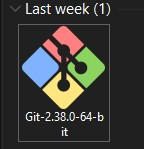
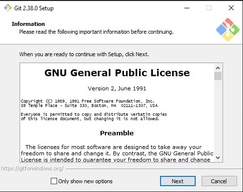
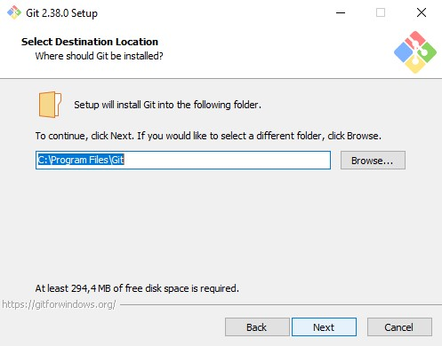
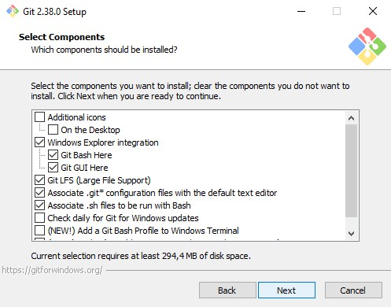
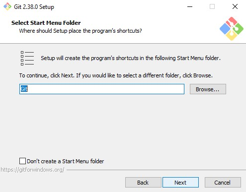
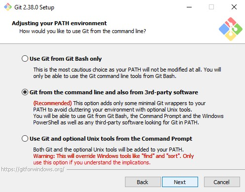

# Cara Menggunakan GIT dan Memasang GIT menggunakan Version Control System
## A. Instalasi GIT :

1. Download git di link berikut : https://git-scm.com/downloads

2. Setelah mendownload GIT buka Histori download lalu buka GIT yang sudah didownload

3. Setelah aplikasi GIT dibuka maka akan muncul informasi lisensi Git, klik Next> untuk melanjutkan.

4. Selanjutnya menentukan lokasi instalasi. Sesuaikan dengan default penyimpanan anda, kemudian klik Next>.

5. Selanjutnya pemilihan komponen, biarkan saja sesuai default dan gambar dibawah ini, lalu klik Next>.

6. Selanjutnya pemilihan direktori start menu, klik Next>.

7. Selanjutnya pengaturan PATH Environment. Pilih yang tengah agar perintah Git dapat di kenali di Command Prompt (CMD). Setelah itu klik Next>.

8. Selanjutnya konversi line ending. Biarkan saja seperti default, kemudian klik Next>.

